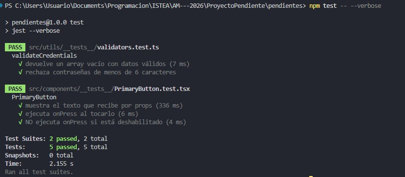

## Presentacion

**1er Parcial - Gestor de tareas "Pendientes"** 

Marteria: Aplicaciones Móviles 
Profesor: Martin Cornejo

Alumno: Joaquin Demarchi
Institucion: ISTEA
Año: 2026

## Tecnologías
 
- React Native + Expo SDK 57 (TypeScript)
- React Navigation — Native Stack
- AsyncStorage (usuarios y tareas)
- expo-notifications (notificaciones locales)
- Jest + jest-expo + React Native Testing Library

## Funcionalidades implementadas
 
- Registro de usuario (usuario + contraseña) guardado en AsyncStorage.
- Login que valida contra los usuarios guardados. Sin sesión no se puede entrar a la app.
- Botón **Salir** para cerrar sesión (al cerrar la app hay que volver a loguearse).
- Alta de tareas con título y recordatorio opcional (10 s, 1 min, 5 min o 1 h).
- Lista de tareas del usuario.
- Marcar tarea como hecha (cancela el aviso pendiente).
- Edición de tareas (título y recordatorio).
- Eliminación de tareas con confirmación (cancela el aviso pendiente).
- Las tareas se guardan por usuario y persisten al cerrar la app.
- 4 tests con Jest + React Native Testing Library: 2 de un componente reutilizable (PrimaryButton) y 2 de lógica de negocio (validación de credenciales).

## Tests

## Video demo

[Ver demo en YouTube](https://www.youtube.com/shorts/RhJD05pp2Yk)
